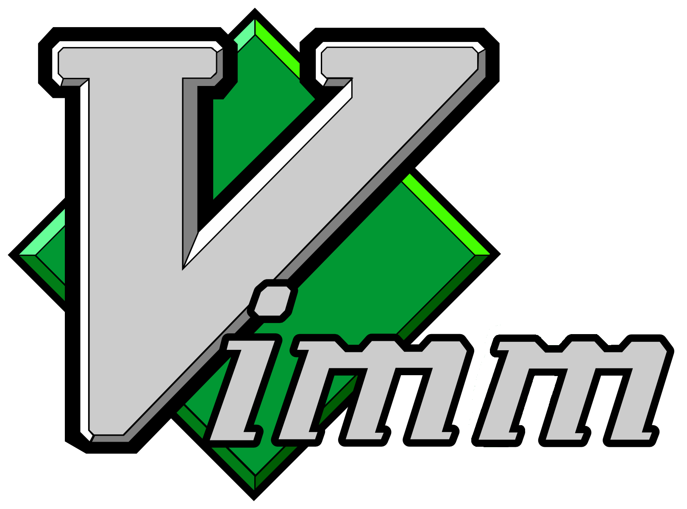

# Vimm

Our extension to the First Year C Project at Imperial. 'Vimm' is a vim-like text editor with auto-complete functionality for the C programming language.

<p align="center">

</p>

 
## Releases 
    Coming soon

## How to use
### Compilation instructions
1. `git clone https://github.com/jessicalally/vimm`
1.  run `make editor` to compile the editor (without tests)
1.  run `./editor (filename)` to edit a file
### Keyboard shortcuts
 - Control + S - Save File
 - Control + C - Close Vimm

## Tests (Optional)
All the tests can be executed from a single command. To run all the tests run 
```sh
make test
```
## Special Thanks
Team members: James Ball, Matthew Giles, Jessica Lally and Andy Wang

GitHub Editor: [overclockedllama](https://github.com/overclockedllama)
